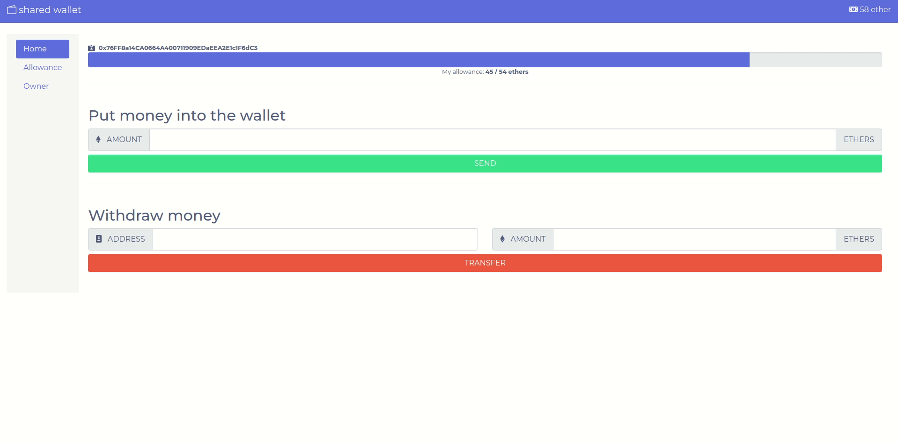

# Shared Wallet Dapp

Just a fast first dapp to play with it and learn something, idk, it has a lot to improve but it was fun as a first contact project. I'm 100% sure that soon i will find some fancy solution for the tricks that i had to do sometimes.



It uses VueJS, Drizzle and Truffle and i'm also using Ganache.

My RPC server is running on

```
HTTP://127.0.0.1:7545
```

So, after having your server up and running, you should run yarn to install the dependencies and configure the truffle-config.js network and then migrate the contracts with:

```
yarn install
truffle migrate
```

For the vue app, just enter the vapp folder and on terminal, type:

```
yarn install
yarn serve
```

Oh.. and i'm using MetaMask. Remember to import your accounts, create the network, etc.
